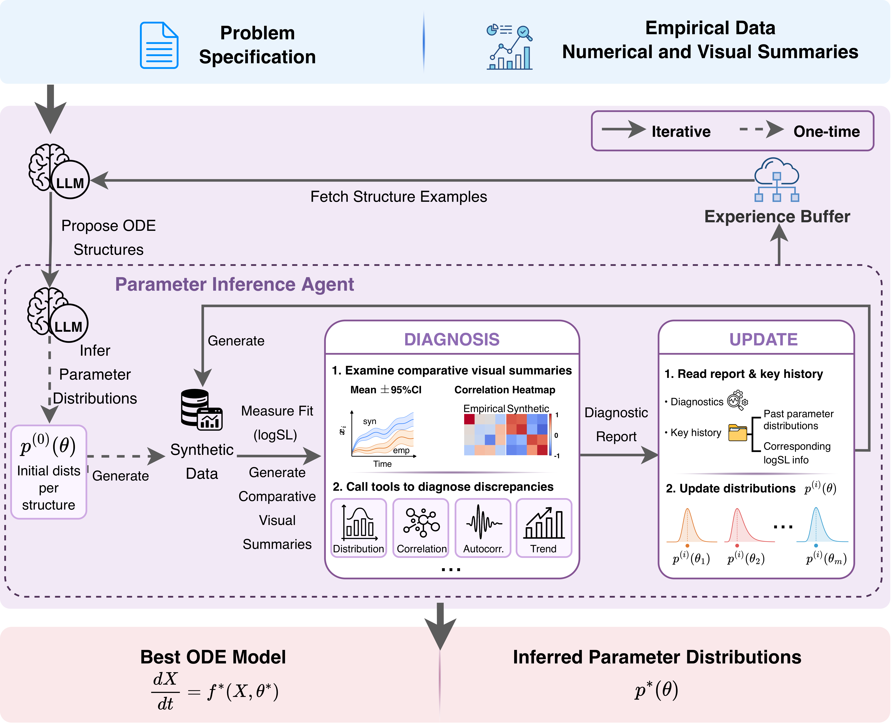

# Agentic ODE Discovery and Parameter Distribution Inference from Summary Statistics for Rare Diseases

## Overview
**AgentODE:** a framework that jointly discovers ODE structures and refines parameter distributions from population-level summary statistics.

The framework supports:
- **ODE skeleton discovery** - LLM-guided generation and refinement of ODE system structures informed by domain knowledge
- **Parameter distribution inference** - Estimation of population-level parameter distributions from summary statistics



## Installation

Create a conda environment and install dependencies.

```bash
conda create -n agentode python=3.11 pip
conda activate agentode
pip install -r requirements.txt
```

## Dataset
A PKPD example dataset is provided in [data/pkpd/](./data/pkpd).

## Data Preparation

Run these two steps once per dataset before starting the pipeline.

### 1. Compute summary statistics

The pipeline scores ODE candidates against observed population-level summary statistics. Cache them with:

```bash
python -m analysis.pipeline.ts_summary_stats \
  --data data/<PROBLEM_NAME>/<DATA>.csv \
  --out_root workspace/<PROBLEM_NAME>/stats
```

Example:

```bash
python -m analysis.pipeline.ts_summary_stats \
  --data data/pkpd/pkpd_train.csv \
  --out_root workspace/pkpd/stats
```

Output: `workspace/<PROBLEM_NAME>/stats/ts_stats.csv` and `ts_stats.json`.

### 2. Generate trajectory figures

Produce mean trajectory plots, baseline-stratified panels, and a difference-correlation heatmap for exploratory analysis:

```bash
python -m analysis.pipeline.trajectory_analysis \
  --data data/<PROBLEM_NAME>/<DATA>.csv \
  --problem_name <PROBLEM_NAME> \
  --bin_width <BIN_WIDTH>
```

Example:

```bash
python -m analysis.pipeline.trajectory_analysis \
  --data data/pkpd/pkpd_train.csv \
  --problem_name pkpd \
  --bin_width 0.5
```

Output figures are saved to `workspace/<PROBLEM_NAME>/figures/`.

## Usage

### 1. Choose and Configure LLM Backends

The pipeline uses two LLM roles that can be assigned independently:

| Role | Task | `--structure_backend` / `--param_backend` |
|---|---|---|
| Structure | ODE skeleton discovery | `local` \| `openwebui` \| `api` |
| Parameter | Parameter distribution inference | `local` \| `openwebui` \| `api` |

If `--param_backend` is omitted it falls back to `--structure_backend`.

#### Option A: Local LLM server

Start one or two local engines (structure on port 5000, parameter on port 5001):

```bash
# ODE structure discovery
python llm_engine/engine.py \
  --model_path <MODEL_PATH> \
  --gpu_ids <GPU_ID> \
  --port 5000 \
  --quantization

# Parameter inference (can use a different model)
python llm_engine/engine.py \
  --model_path <MODEL_PATH> \
  --gpu_ids <GPU_ID> \
  --port 5001 \
  --quantization
```

Then run with:

```bash
python main.py \
  --structure_backend local \
  --problem_name <PROBLEM_NAME> \
  --spec_path <SPEC_PATH> \
  --log_path <LOG_PATH>
```

#### Option B: OpenWebUI

Point the pipeline at an OpenWebUI instance:

```bash
export OPENWEBUI_API_KEY=<YOUR_OPENWEBUI_KEY>

python main.py \
  --structure_backend openwebui \
  --openwebui_url https://<YOUR_OPENWEBUI_HOST>/api \
  --structure_model <MODEL_NAME> \
  --problem_name <PROBLEM_NAME> \
  --spec_path <SPEC_PATH> \
  --log_path <LOG_PATH>
```

#### Option C: Cloud API (OpenAI / DeepSeek)

```bash
export OPENAI_API_KEY=<YOUR_KEY>      # or DEEPSEEK_API_KEY, ANTHROPIC_API_KEY, etc.

python main.py \
  --structure_backend api \
  --api_provider openai \
  --structure_model gpt-4o \
  --problem_name <PROBLEM_NAME> \
  --spec_path <SPEC_PATH> \
  --log_path <LOG_PATH>
```

#### Mixing backends

Use different backends or models for each role. Each backend reads its own key:

```bash
export OPENWEBUI_API_KEY=<YOUR_OPENWEBUI_KEY>
export OPENAI_API_KEY=<YOUR_OPENAI_KEY>        # or DEEPSEEK_API_KEY, etc.

python main.py \
  --structure_backend openwebui \
  --openwebui_url https://<YOUR_OPENWEBUI_HOST>/api \
  --structure_model <LARGE_MODEL> \
  --param_backend api \
  --param_model gpt-4o \
  --api_provider openai \
  --problem_name <PROBLEM_NAME> \
  --spec_path <SPEC_PATH> \
  --log_path <LOG_PATH>
```

### 2. Run ODE Discovery

```bash
python main.py \
  --structure_backend <BACKEND> \
  --problem_name <PROBLEM_NAME> \
  --spec_path <SPEC_PATH> \
  --log_path <LOG_PATH>
```

Example (PKPD with OpenWebUI):

```bash
python main.py \
  --structure_backend openwebui \
  --openwebui_url https://<YOUR_OPENWEBUI_HOST>/api \
  --structure_model <MODEL_NAME> \
  --problem_name pkpd \
  --spec_path specs_skeleton/specification_pkpd_numpy.txt \
  --log_path logs/pkpd_run1
```

> **Debug logging:** set `AGENTODE_DEBUG_PRINTS=1` to print prompts, LLM responses, parameter distributions, and island states.

#### Resuming an interrupted run

The pipeline saves a checkpoint to `<LOG_PATH>/checkpoint.pkl` every 50 registered programs. Rerunning the same command resumes automatically:

```bash
python main.py \
  --structure_backend <BACKEND> \
  --problem_name <PROBLEM_NAME> \
  --spec_path <SPEC_PATH> \
  --log_path <LOG_PATH>   # resumes automatically if checkpoint exists
```

To start fresh, delete `<LOG_PATH>/checkpoint.pkl`.

### 3. Visualize Results

Monitor training progress with TensorBoard:
```bash
tensorboard --logdir=<LOG_PATH>
```

### 4. Analyze Discovered Systems

**Find the best system:**
```bash
python analysis/posthoc/find_best_system.py --log_path <LOG_PATH>
```
Returns: Best score and sample order.

**Visualize trajectories for a specific system:**
```bash
python analysis/posthoc/syn_traj_visuals.py \
  --problem_name <PROBLEM_NAME> \
  --sample_order <SAMPLE_ORDER> \
  --log_path <LOG_PATH>
```
Saves observed-vs-synthetic trajectory figures to `<LOG_PATH>/figures/sample<SAMPLE_ORDER>/`.

### Configuration
Adjust pipeline parameters in [config.py](agentode/config.py).


## License

This project is licensed under the MIT License - see the [LICENSE](LICENSE) file for full details.

This work is adapted from [LLM-SR](https://github.com/deep-symbolic-mathematics/LLM-SR) by Shojaee et al., which itself builds upon [FunSearch](https://github.com/google-deepmind/funsearch), [PySR](https://github.com/MilesCranmer/PySR), and [Neural Symbolic Regression that scales](https://github.com/SymposiumOrganization/NeuralSymbolicRegressionThatScales).

We thank the original contributors of these works for open-sourcing their valuable code.
